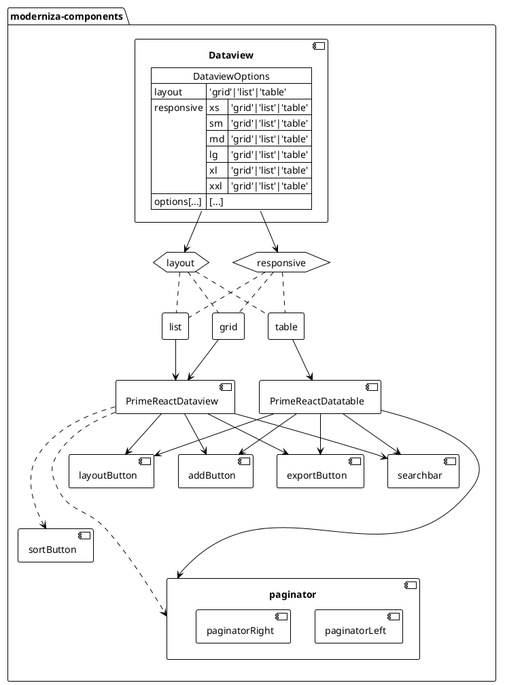

# Dataview

[[Retornar]](../documentation/index.md)

Componente dinâmico criado através dos componentes do primereact **Dataview** e **Datatable**.

## Diagrama do componente

```plantuml
@startuml dataviewDiagram
' Muda o tema
!theme plain
' Permite mixar tipos diferentes
allowmixing

package moderniza-components{
    
    component Dataview{
        json DataviewOptions {
            "layout":"'grid'|'list'|'table'",
            "responsive":{
                "xs":"'grid'|'list'|'table'",
                "sm":"'grid'|'list'|'table'",
                "md":"'grid'|'list'|'table'",
                "lg":"'grid'|'list'|'table'",
                "xl":"'grid'|'list'|'table'",
                "xxl":"'grid'|'list'|'table'"
            },
            "options[...]":"[...]"
        }
    }

    component PrimeReactDatatable
    component PrimeReactDataview

    hexagon layout
    hexagon responsive

    rectangle grid
    rectangle table
    rectangle list

    component addButton
    component sortButton
    component exportButton
    component searchbar
    component layoutButton
    component paginator{
        component paginatorLeft
        component paginatorRight
    }

    DataviewOptions -down-> responsive
    DataviewOptions -down-> layout

    layout .. grid
    layout .. table
    layout .. list

    responsive .. grid
    responsive .. table
    responsive .. list

    list --> PrimeReactDataview
    grid --> PrimeReactDataview
    table --> PrimeReactDatatable

    PrimeReactDatatable --> searchbar
    PrimeReactDatatable --> addButton
    PrimeReactDatatable --> layoutButton
    PrimeReactDatatable --> exportButton
    PrimeReactDatatable --> paginator

    PrimeReactDataview --> searchbar
    PrimeReactDataview .--> sortButton
    PrimeReactDataview --> addButton
    PrimeReactDataview --> layoutButton
    PrimeReactDataview --> exportButton
    PrimeReactDataview ..--> paginator

}

@enduml
```
